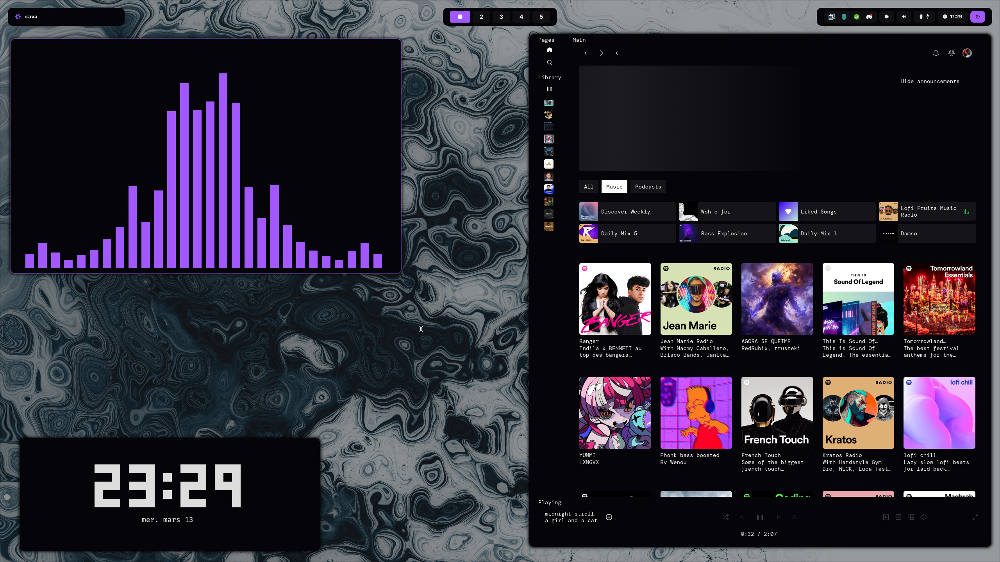
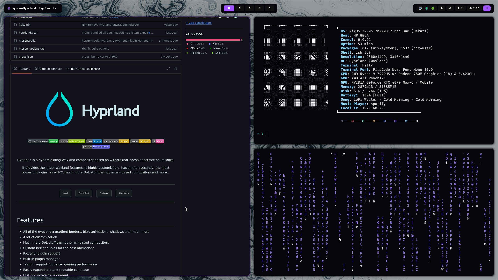

# Nixy

This is my dotfiles repo. It's a work in progress, and I'm still learning how to use nix.

# Images





# Apps

- WM: *Hyprland*
  - hyprlock
  - hyprpaper
  - hypridle
  - wlogout
- File manager:
  - lf
  - thunar
- Terminal: kitty
- Shell: zsh
  - Prompt: starship
  - Bat, eza, zoxide, fzf, ripgrep
- Editor: nixvim
- Browser: qutebrowser
- Music: spictify
- Bar: waybar
- Notifications: dunst
- Launcher: wofi
- DM: Tuigreet

# Themes & Colors

Themes and colors are managed by the `home/variable/theme` folder.

# Scripts

## Nix/NixOs shortcuts

- `nixy-edit`
- `nixy-rebuild`
- `nixy-update`
- `nixy-gc` # garbage collection
- `nixy-cb` # clean boot menu

## Brightness control

- `brightness-up`
- `brightness-down`
- `brightness-change <up/down> <increment>`

## Sound control

- `sound-up`
- `sound-down`
- `sound-toggle`
- `sound-output`
- `sound-change <up/down/mute> <increment>`

## Caffeine

Caffeine is a simple script that toggles hypridle (disable suspend & screenlock).

- `caffeine` # Toggle caffeine
- `caffeine-status` # Return active/inactive

## Night-Shift

Blue light filter, using wlsunset

- `night-shift-on`
- `night-shift-off`

# Installation

```sh
git clone https://github.com/anotherhadi/nixy ~/.config/nixos
```

- Every things that you *must* change got a "CHANGEME" comment. You can search for it with ripgrep: `rg "CHANGEME"`
- Every things that you *must* remove got a "REMOVE" comment. You can search for it with ripgrep: `rg "REMOVE"` (Secrets, own stuff..)
- Change the `nixos/configuration.nix` file to match your system
- Copy your `hardware-configuration.nix` file to the `nixos` folder

```sh
sudo nixos-rebuild switch --flake ~/.config/nixos#nixy
```

# TODOLIST

- [ ] Variable user & homeDir
- [ ] Custom GTK based on the colorscheme
- [ ] Obsidian.nvim on every markdown file
- [ ] Nextcloud services (Only on my personnal network)
- [ ] Caffeine & Night-Shift replace notif
- [ ] Raycast like launcher
