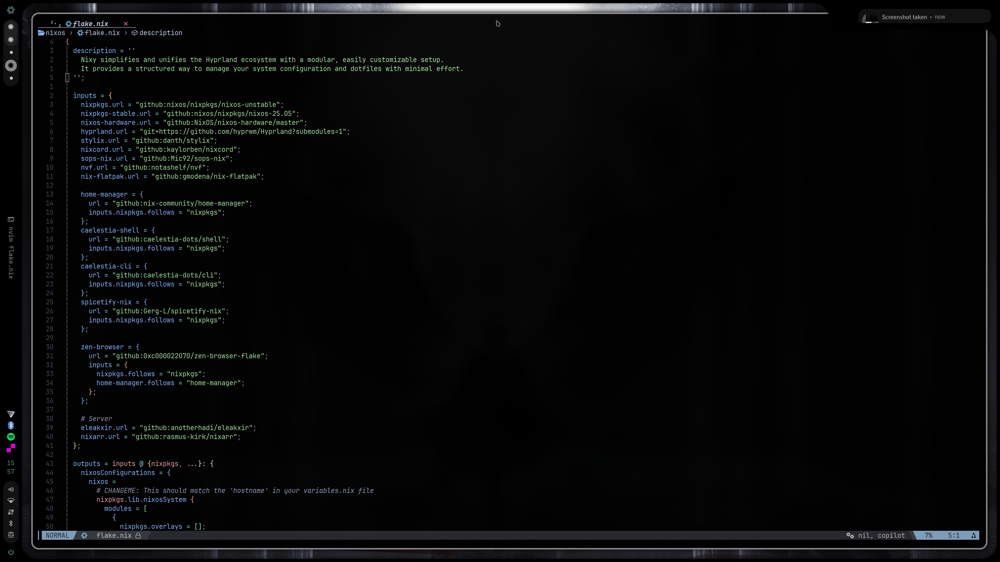
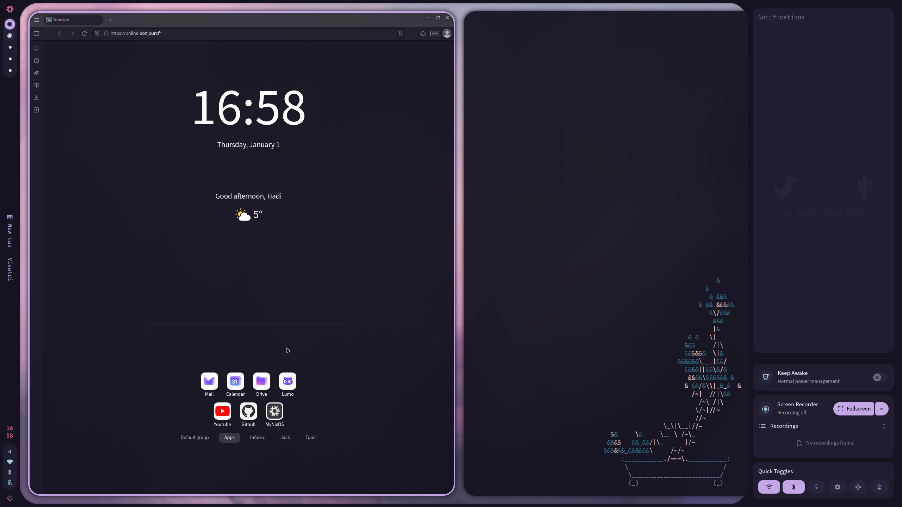

[//]: # "This file is autogenerated"

<div align="center">
    
</div>

<br>

# Nixy_Prizrak

<br>
<div align="center">
    <a href="https://github.com/anotherhadi/nixy/stargazers">
        
    </a>
    <a href="https://github.com/anotherhadi/nixy/">
        
    </a>
    <a href="https://nixos.org">
        
    </a>
    <a href="https://github.com/anotherhadi/nixy/blob/main/LICENSE">
        
    </a>
</div>
<br>

**Nixy simplifies and unifies** the Hyprland ecosystem with a modular, easily
customizable setup. It provides a structured way to manage your system
configuration and dotfiles with minimal effort. It includes _home-manager_,
_secrets_, and _custom theming_ all in one place.

**Features:**

- 💻 Hyprland & Caelestia: Preconfigured Hyprland ecosystem with Caelestia-shell (Ty to both projects!)
- 🎨 Consistent Theming: Base16 & Stylix-powered themes
- ⌨️ Vim-like Everywhere: Unified keybindings (Hyprland, nvim, vimium, etc.)

## Table of Content

- [Table of Content](#table-of-content)
- [Screenshots](#screenshots)
- [Architecture](#architecture)
  - [🏠 /home (User-level configuration)](#-home-user-level-configuration)
  - [🐧 /nixos](#-nixos)
  - [🎨 /themes](#-themes)
  - [💻 /hosts](#-hosts)
  - [🖥️ /server-modules](#-server-modules)
- [Installation](#installation)
- [Documentation](#documentation)

## Screenshots




<!--  -->

## Architecture

### 🏠 /home (User-level configuration)

Contains **dotfiles and settings** that apply to your user environment.

**Subfolders:**

- `programs` is a collection of apps configured with home-manager
- `system` is some "desktop environment" configuration

### 🐧 /nixos

Those are the system-level configurations. (audio, bluetooth, gpu, bootloader,
...)

### 🎨 /themes

This folder contains all system themes. Mainly
[stylix](https://stylix.danth.me/) configurations. Check out the available
themes and learn how to create your own in [THEMES.md](docs/THEMES.md)

### 💻 /hosts

This directory contains host-specific configurations. Each host includes:

- `configuration.nix` for system-wide settings
- `home.nix` for user-level configuration
- `variables.nix` for global variables
- `secrets/` for sensitive data

### 🖥️ /server-modules

This folder contains server-related nixos modules. (bitwarden, nextcloud, ...)

## Installation

1. [Fork](https://github.com/anotherhadi/nixy/fork) this repo and clone it to
   your system:

```sh
git clone https://github.com/anotherhadi/nixy ~/.config/nixos
```

2. Copy the `hosts/laptop` folder, rename it to match your system’s hostname,
   and update `variables.nix` with your machine’s settings.
3. Copy your `hardware-configuration.nix` into your new host's folder to ensure
   proper hardware support.
4. Register your new host in `flake.nix` by adding it under nixosConfigurations.

> [!IMPORTANT]
> `# CHANGEME` comments are placed throughout the config to
> indicate necessary modifications. Use the following command to quickly locate
> them:
>
> ```sh
> rg "CHANGEME" ~/.config/nixos
> ```

> [!TIP]
> When you add new files, don't forget to run `git add .` to add them to the git
> repository

5. Build the system

```sh
sudo nixos-rebuild switch --flake ~/.config/nixos#yourhostname
```

## Documentation

- [SERVER](docs/SERVER.md): Check out the server documentation
- [THEMES](docs/THEMES.md): How themes work and how to create your own
- [WALLPAPERS](https://github.com/anotherhadi/awesome-wallpapers): An awesome
  collection of wallpapers

- [CONTRIBUTING](docs/CONTRIBUTING.md): How to contribute
- [LICENSE](LICENSE): MIT License
