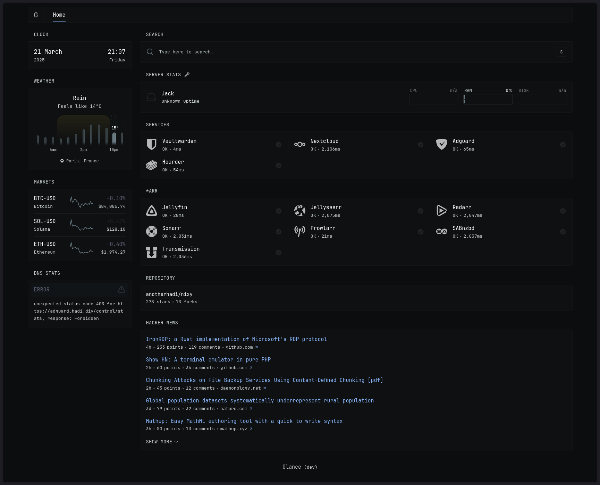

# SERVER

## Overview  

This document describes the architecture and setup of the self-hosted **NixOS server**, which is securely accessible via **Tailscale**. The server is designed for private, secure, and easily manageable self-hosting of various services.

## **Why This Setup?**  

- **Private & Secure**: Services are only accessible through Tailscale, preventing exposure to the public internet.  
- **Domain-based Access**: A custom domain (`example.org`) maps to the server's Tailscale IP, making service access simple and consistent.  
- **Automatic SSL Certificates**: Using DNS-01 challenges, valid SSL certificates are generated even though the services are not publicly exposed.  
- **Modular & Declarative**: Everything is managed through NixOS modules, ensuring reproducibility and easy configuration.  

## **Self-Hosted Services**  

The server hosts several key applications:  

### **Core Infrastructure**  

- **NGINX**: Reverse proxy for routing traffic to services via `example.org`.  
- **Bitwarden**: A self-hosted password manager for secure credential storage.  
- **Nextcloud**: A private cloud solution for file synchronization and collaboration.  

### **Networking & Security**  

- **AdGuard Home**: A self-hosted DNS ad blocker for network-wide ad and tracker filtering.  

### **Monitoring & Storage**  

- **Glance**: An awesome dashboard! (See the screenshot above)
- **Hoarder**: A self-hostable bookmark-everything app (links, notes and images)

### **Media & Content Management**  

- **Arr Stack (Radarr, Sonarr, etc.)**: Automated media management tools for handling movies and TV shows. (legaly ofc)

## **How It Works**  

1. **Domain Configuration**  
   - `example.org` is pointed to the Tailscale IP of the server. (cloudflare A record, not proxied)
   - This allows for easy access without exposing services to the internet.  

2. **SSL Certificate Generation**  
   - Certificates are obtained using a **DNS-01 challenge**, verifying domain ownership without requiring public access.

3. **NGINX Reverse Proxy**  
   - Routes incoming requests from `*.example.org` to the correct internal service.  
   - Ensures SSL termination and secure connections.  

4. **Access Control**  
   - Only devices within the Tailscale network can reach the services.  
   - Firewall rules restrict access further based on necessity.

## What's Next?

I want to self-host:

- **A great todolist app**: One that is compatible with markdown & IOS
- **Cyberchef**
- **Maybe**: An app to manage finances
