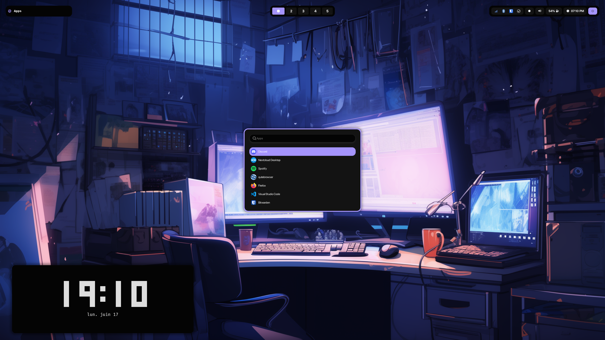
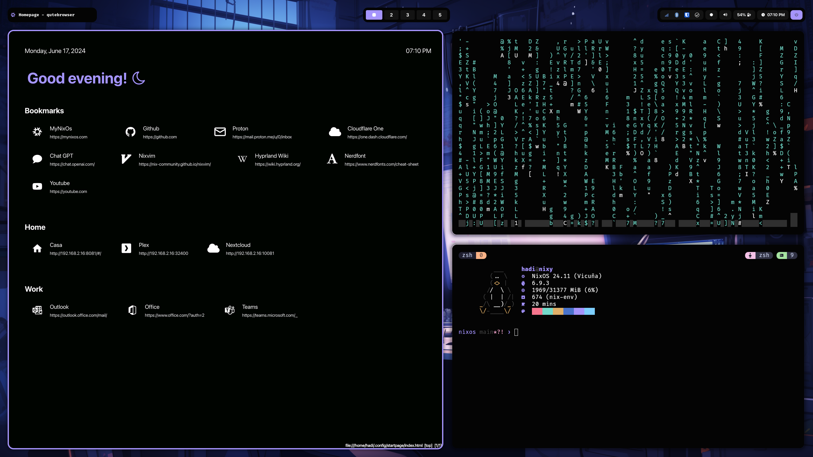
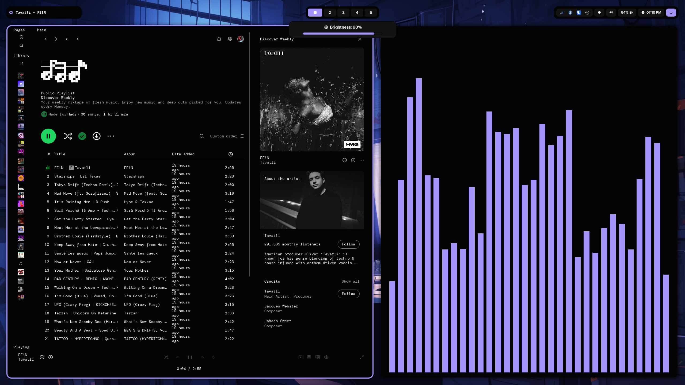

# Themes

Themes are defined in `themes`. Those themes define the colors, fonts, icons, etc, used by Hyprland and the apps/programs installed.
You can change the selected theme by changing the import statement of your host's configuration.nix file.

> [!TIP]
> To apply the theme to DuckDuckGo, follow the instructions in `$HOME/.duckduckgo-colorscheme.js`

## Create your theme

Create a copy of one of the existing themes and change the variables.
Wallpapers are loaded from the [nixy-wallpapers](https://github.com/anotherhadi/nixy-wallpapers) repo.

## Gallery

### Nixy

